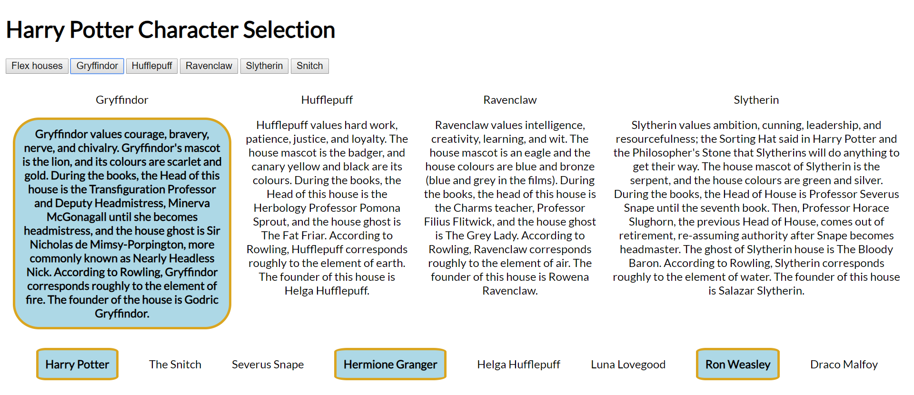

# Harry Potter Character Selection

In this exercise you will be creating functions that will manipulate the style and the text of this HTML page. Use the information that you have learned from Period 1 and 2 to complete this assignment.

NOTE: the goal for this exercise is to ONLY create & edit JavaScript. Leave the HTML and CSS files alone.

## Directions

- Create a new JavaScript file called scripts.js. The HTML file already has the script tag.

- Create a function called addTitle(), which will find the h1 element and adds the following title inside of it: "Harry Potter Character Selection".

- Create a function called flexIt(), which should find the first element with the class called 'needFlex' and add the class flexIt to that element and then toggle the flexIt class on and off.

- Create a function called emphasize() with one parameter called house. When the user clicks the button labeled with one of the four Hogwarts houses, your function applies the CSS labled 'emphasis' in the CSS file to the HTML describing that house (see mockup below for an illustration).

- Adjust the emphasize(house) function so that both the house and the individuals in that house are highlighted (see mockup below).

- Create a function called addHouses(), which will find all the paragraphs that has a class called "description" and will set another class name. The new class name should be the name of the four Hogwarts houses. Example: if the paragraph is about Ravenclaw, find that paragraph and set the attribute to include ravenclaw as the 2nd class.

Bonus: Create a new function called hideTheSnitch() that makes the words "The Snitch" appear and disappear.  To do this, you can adjust the element's display attribute to be either "none" or not.

## Mockup

## Submission
Push your code to your Github account and then paste the link to the repo when submitting. If you do not finish in class, submit what you were able to get done.

### Assignment Hints
- `document.getElementsByClassName` puts elements with the specific class into an array. 
- `document.querySelectorAll()` returns an array of all matches
- `toggle()` gives you the ability to turn things off and on

Push your code to GitHub and submit the URL below!
